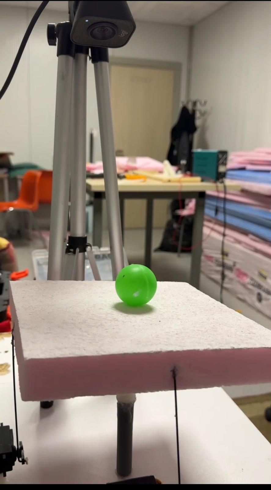
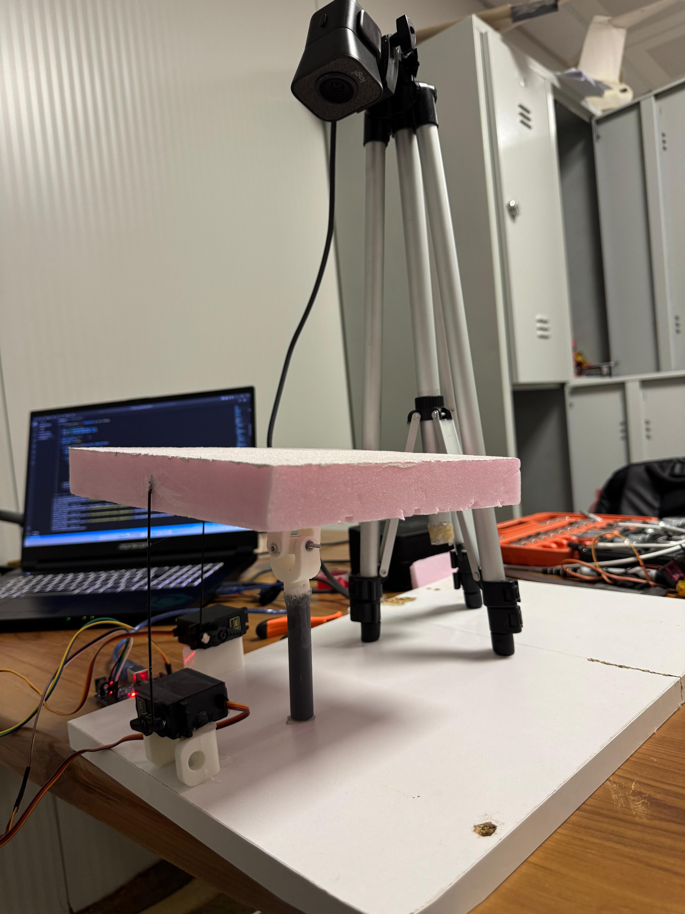
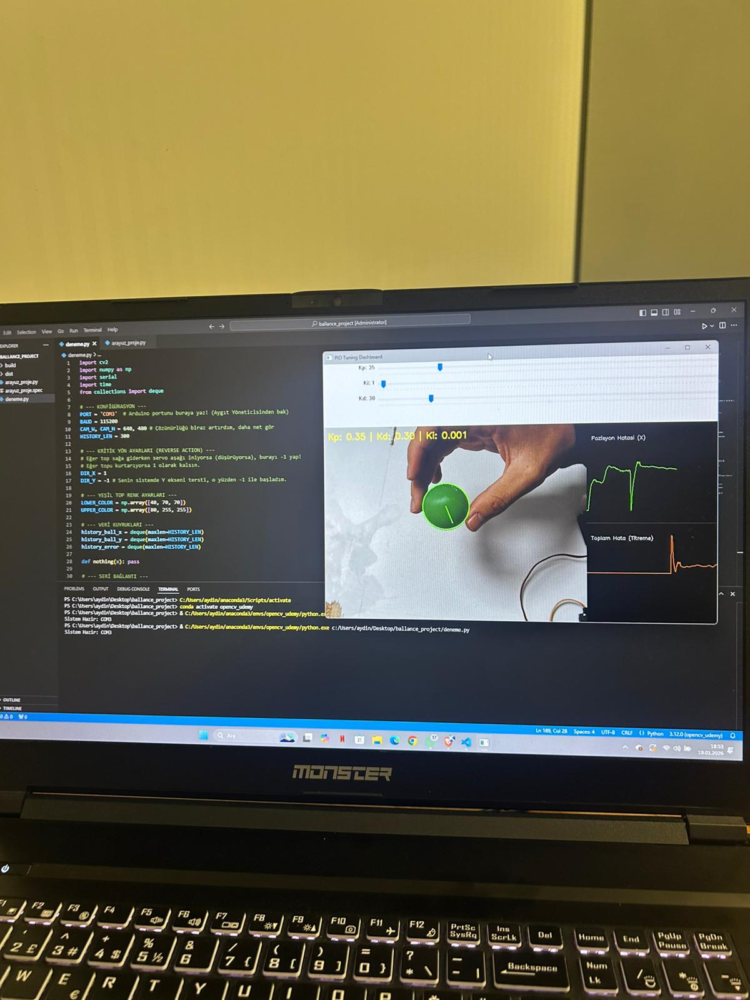

# 2-DOF Ball and Plate Balancing System


## 📖 Overview
This project focuses on the design and implementation of a **Ball and Plate** control system. The primary objective is to balance a ball at a specific coordinate or follow a trajectory on a flat surface using a 2-DOF (Degrees of Freedom) platform.

Unlike traditional setups, this project implements the **PID Control Algorithm directly in Python**, centralizing both the Computer Vision processing and Control Logic on the PC side.

## 🚀 Key Features
* **Python-Based Control:** The PID algorithm runs within the Python script, allowing for easier tuning and complex trajectory planning.
* **Real-Time Tracking:** Utilizes a standard webcam and **OpenCV** to detect the ball's position.
* **Serial Interface:** Arduino acts as a bridge, receiving calculated servo angles from Python via Serial communication and driving the motors.
* **Mechanical Design:** Features a custom-designed **2-axis universal joint** modeled in **SolidWorks**.

## 🛠️ Tech Stack & Components

### Software
* **Python:** Handles Image Processing (OpenCV), PID Calculation, and Serial Communication.
* **OpenCV:** Used for object detection and coordinate extraction.
* **Serial Communication:** Python sends precise servo angles to the Arduino.

### Firmware
* **C++ / Arduino IDE:** Simple firmware that listens to the Serial port and actuates the servos based on Python's commands.

### Hardware
* **Microcontroller:** Arduino Uno.
* **Actuators:** 2x High-torque Servo Motors.
* **Mechanical:** Custom 3D printed parts (Universal Joint, Plate, Linkages).
* **Camera:** Standard USB Webcam.

## ⚙️ How It Works
1.  **Vision:** Python (OpenCV) captures the image and calculates the ball's (X, Y) position.
2.  **Calculation:** The Python script compares the position to the setpoint, runs the PID algorithm, and computes the required servo angles.
3.  **Communication:** These angles are sent to the Arduino via USB Serial.
4.  **Actuation:** Arduino receives the data and immediately moves the servo motors to the target position to balance the plate.

   
## 📸 Demo / Visuals

### System Views



## 📂 Project Structure
```bash
├── /arduino_firmware   # Simple serial listener code
├── /python_control     # Main script (Vision + PID logic)
├── /cad_files          # SolidWorks parts
└── README.md
